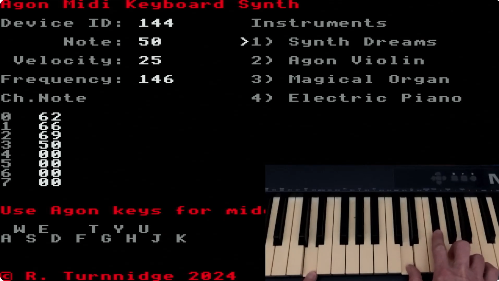

# Midi Keyboard player

Just an experiment to play music on the Agon, from a midi keyboard.

Uses a Python software midi to serial bridge on my Mac to send the midi data into UART1.

Latest binary is available, latest code is not yet.

Video here:

https://youtu.be/9bcqbtdHnz8

